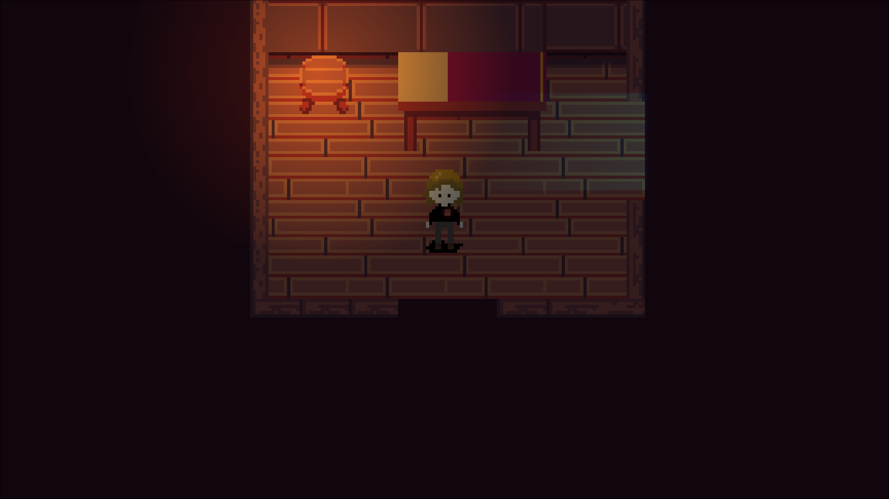
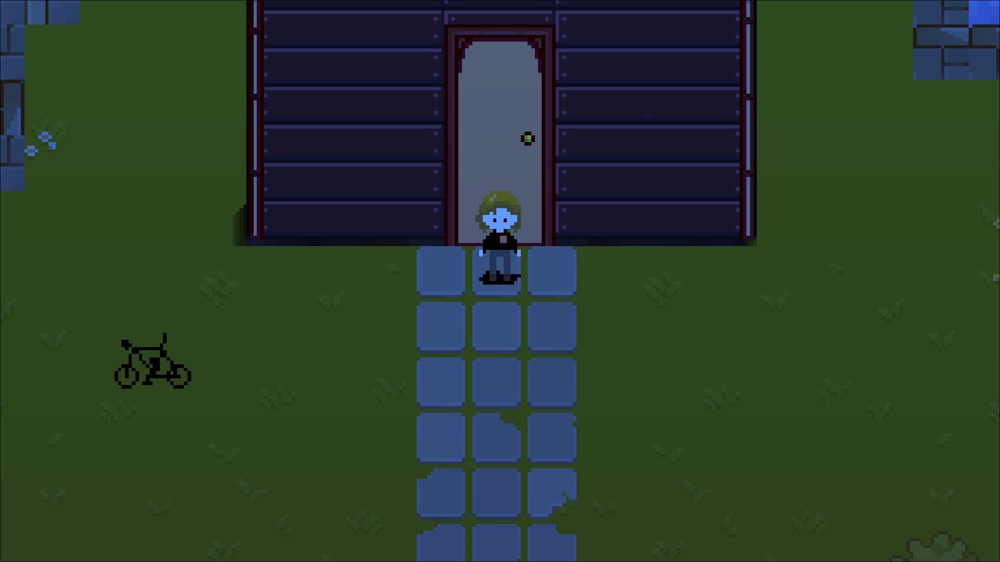
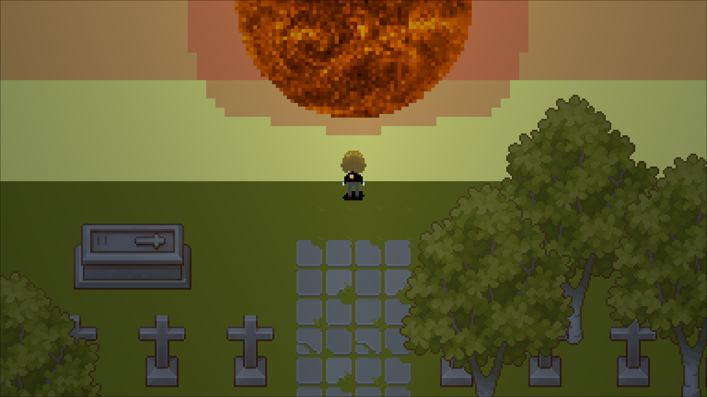

# Katabaino

**Autor:** Bernard Gawor

---

## 1. Opis gry

**Katabaino** (gr. *καταβαίνω* – schodzić w dół, zstępować) to gra eksploracyjna 2D stawiająca na uczucie obcości.

Charakterystyczną cechą gry jest jej narracyjne tempo i klimat, brak systemu walki, skupienie na eksploracji i interakcji z otoczeniem.

---

## 2. Użyte narzędzia

| Element | Technologia |
|---|---|
| Silnik gry | **Godot Engine 4.6** |
| Język skryptowy | **GDScript** |
| Renderer | GL Compatibility (OpenGL) |
| Edytor sprite'ów | **Aseprite** (animacje postaci) |
| Platforma docelowa | Linux / Windows Desktop |

---

## 3. Mechaniki gry

### Świat

Gra zbudowana jest z szeregu oddzielnych, połączonych ze sobą map 2D top-down:

- **Pokój startowy** – scena tutorialowa, blokuje gracza do momentu potwierdzenia klawiszem
- **Las** – wstępna przestrzeń eksploracyjna
- **Głęboki las** – specjalna mapa z zapętlonym przewijaniem: gracz przekraczający krawędź pojawia się po drugiej stronie
- **Kościół**
- **Cmentarz**

### Kamera

Kamera śledzi postać gracza (`Camera2D` z wygładzaniem).

### Postać gracza

- Ruch ośmiokierunkowy (WASD / strzałki), prędkość bazowa: **45 px/s**
- Kierunek patrzenia zapamiętywany po zatrzymaniu
- System interakcji oparty na **RayCast2D** rzut promienia w kierunku patrzenia (16 px), wywołanie metody `_on_interacted()` na trafionej kolizji
- Globalny stan gracza (`PlayerData` – Autoload): przechowuje informację o posiadaniu i użyciu roweru

### Przedmioty i ekwipunek

| Przedmiot | Efekt | Klawisz |
|---|---|---|
| **Rower** | Podnosi prędkość do 90 px/s (x2) |

Rower podnoszony jest z ziemi przez interakcję (`Z`). Po podniesieniu znika z mapy i nie można go podnieść ponownie. Umożliwia klikajać `X` przyśpieszenie gracza.

### NPCe

- **Błądzący NPC** (*wandering_npc*) – prosta maszyna stanów (`IDLE / WANDER`): losowo co 1–3 sekundy zmienia kierunek ruchu lub zatrzymuje się. Prędkość: 25 px/s. Animacje czterokierunkowe zsynchronizowane z wektorem prędkości.
- **Rusałka** – interaktywny NPC; interakcja (`Z`) teleportuje gracza na cmentarz.
- **Fantomowy koń** – dekoracyjny NPC z własną sceną i animacją.

### Interfejs użytkownika

- **Menu pauzy** (`Esc`) – wznów grę / wyjdź
- **Tutorial** – nakładka blokująca ruch gracza na starcie, zamykana przez `Enter/Space`
- **Intro** – 11-sekundowa scena z przewijającym się paralaksowym lasem, przechodzi automatycznie do gry

---

## 4. Użyte assety

### Grafika

| Asset | Źródło |
|---|---|
| Sprite postaci gracza (`sadboy.ase`) | Wykonany ręcznie w Aseprite |
| Sprite rusałki (`rusalka.ase`) | Wykonany ręcznie w Aseprite |
| Sprite gargulca (`gargulec.ase`) | Wykonany ręcznie w Aseprite |
| Tileset lasu (`forest_tileset.tres`, `trees.tres`) | Zaimportowany z zewnętrznych źródeł |
| Tileset wnętrz (`Tileset_Interior Wood_Gnomenlied.png`) | Zaimportowany – Gnomenlied (itch.io) |
| Obóz (`Pixel Camping Pack 32x32`) | Zaimportowany pack (itch.io) |
| Koń (`Horse/`) | Zaimportowany sprite pack |
| Woda (`Water16x16.png`) | Zaimportowany tileset |
| Słońce (`Sun_Pixel.png`) | Zaimportowany asset |

### Dźwięk i muzyka

| Asset | Źródło |
|---|---|
| `erlkonig_slow.ogg` | Klasyczna ballada Schuberta *Erlkönig* – nagranie publiczne |
| `night-ambience.mp3` | Zaimportowany ambient nocny |
| `wind.mp3` | Efekt wiatru |
| `church-bell.mp3` | Efekt dzwonu kościelnego |

---

## 5. Wykorzystanie AI

AI było wykorzystane pomocniczo w procesie developmentu:

- **Asystent kodowania (Claude)** – pomoc przy projektowaniu architektury systemu sygnałów między mapami, systemu przejść scen z punktami spawnu oraz debugowanie
- **Grafika** – sprite'y postaci wykonane ręcznie w Aseprite; żadna grafika nie była generowana przez AI
- **Projekt map** - mapy były projektowane ręcznie
- **Muzyka** – żadna muzyka nie była generowana przez AI; użyto nagrań klasycznych z domeny publicznej oraz gotowych efektów dźwiękowych
- **Zachowanie postaci** – wbudowana prosta maszyna stanów (`IDLE/WANDER`) zaimplementowana ręcznie w GDScript; brak uczenia maszynowego

---

## 6. Uruchomienie gry

### Ze źródeł (Godot Editor)

1. Zainstaluj **Godot Engine 4.6** (https://godotengine.org)
2. Otwórz projekt: `Project → Import` → wskaż plik `project.godot`
3. Uruchom: klawisz `F5` lub `Project → Run`

### Moduł wykonywalny

Wersja wykonywalna (Linux x86_64 / Windows) dostępna w sekcji **Releases** repozytorium lub jako załącznik do zgłoszenia projektowego.

### Sterowanie

| Klawisz | Akcja |
|---|---|
| `WASD` / strzałki | Poruszanie się |
| `Z` | Interakcja z obiektem/NPC |
| `X` | Użyj efektu (rower) |
| `Esc` | Pauza |
| `Enter` / `Spacja` | Potwierdź (tutorial) |

---

## 7. Screenshoty

*Pokój startowy – wnętrze domu*

*Eksploracja – wejście do kościoła, rower do zebrania*

*Cmentarz – cel podróży*

---

## 8. Bibliografia

- Godot Engine 4.x – dokumentacja oficjalna: https://docs.godotengine.org
- Goethe, J.W. – *Erlkönig* (1782) – inspiracja fabularna i muzyczna
- Tileset wnętrz: *Tileset Interior Wood* – Gnomenlied (itch.io)
- *Pixel Camping Pack 32x32* – itch.io
